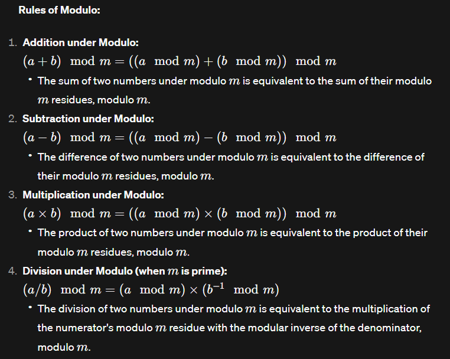

# Foundation Maths

#### Why modulo arithmetic?

- To avoid overflow
- Cyclic patterns
- Wrapping a range

#### What's special about (10^9 + 7) ?
- that's a large (close to 2^31) prime number
- inverse of primes are always possible

---

**Notations:**
* `A = B (mod C)` => `A%C = B%C` implies A and B are equivalent in the modular realm of C
* `C | A-B` It also means C divides (A-B)

## Operations under Modulo



**Imp Note:** 
- Range of mod is `[0, mod-1]`
- To consider ans becoming non-negative in Qs, do `(ans + mod) % mod` at last.

## Modular Inverse

- The concept of division is often replaced by finding the modular inverse.
- The modular inverse of a number a with respect to a modulus m is another number x such that `(a*x) mod m = 1`.
- ```a*x = 1 (mod m) , x is the inverse of a w.r.t m ```
- Not all number have a modular inverse

## Fermat's Little Theorem and Inverses:
<!-- `p | (a^p - a)` -->
$$
 p \space|\space (a^p - a) 
$$

*If p is prime, ($a^p$ - a) is divisible by p, for every any integer a.*


Glimpse into some derivation:
- p | $ (a^p - a) $
- p | $ a (a^{p-1} - 1) $
- $ a^{p-1} = 1 (mod) $
- $ a.a^{p-2} = 1 (mod)$ ; thus $a^{p-2}$ is the inverse!

### INVERSE:
``` 
x = a^(p-2) is the inverse of a w.r.t modulo p 
```

### Another modulo operation:

$$ a^b \% mod = a^{b\%(mod-1)} \%mod $$

