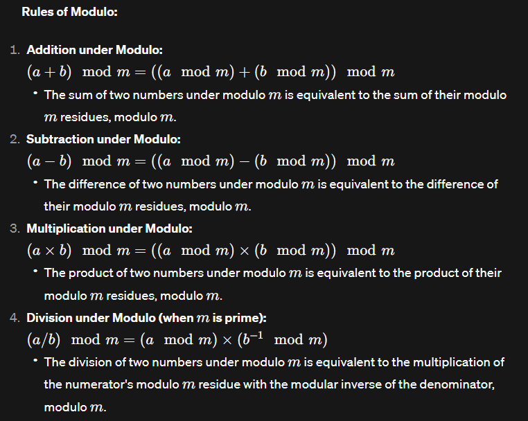

# Modular Arithmetic
#### Why modulo arithmetic?

- To avoid overflow
- Cyclic patterns
- Wrapping a range

#### What's special about (10^9 + 7)?
- that's a large (close to 2^31) prime number
- inverse of primes are always possible

---

**Notations:**
* `A = B (mod C)` => `A%C = B%C` implies A and B are equivalent in the modular realm of C
* `C | A-B` It also means C divides (A-B)

### Operations under Modulo



**Important Note:**
- Range of mod is `[0, mod-1]`
- To ensure the answer is non-negative in problems, do `(ans + mod) % mod` at last.

## Modular Inverse

- The concept of division is often replaced by finding the modular inverse.
- The modular inverse of a number `a` with respect to a modulus `m` is another number `x` such that `(a*x) mod m = 1`.
- `a*x = 1 (mod m)`, `x` is the inverse of `a` w.r.t `m`.
- Not all numbers have a modular inverse.

### Fermat's Little Theorem and Inverses:

If `p` is prime, then `(a^p - a)` is divisible by `p` for any integer `a`.

Glimpse into some derivation:
- `p | (a^p - a)`
- `p | a * (a^{p-1} - 1)`
- `a^{p-1} = 1 (mod p)`
- `a * a^{p-2} = 1 (mod p)`; thus `a^{p-2}` is the inverse!

### INVERSE:
```
x = a^(p-2) is the inverse of a w.r.t modulo p 
```

### Another modulo operation:

`a^b % mod = a^( b % (mod-1)) % mod`

*You can derive this using `a^{p-1} = 1 (mod p)`.*

# Foundation Maths

## Binary Exponentiation

**Recursive:**
```cpp
ll binpow(ll a, ll n, ll mod) {
    if (n == 0)
        return 1;

    if (n % 2) {
        return a * binpow(a, n - 1, mod) % mod;
    } else {
        ll temp = binpow(a, n / 2, mod);
        return temp * temp % mod;
    }
}

ll binpow2(ll a, ll n, ll mod) {
    if(n==0) return 1;

    ll res = binpow(a, n/2, mod);
    res = (res * res) % mod;
    if(n%2!=0) {    // when odd, multiply once more
        res = (res * a) % mod;
    }
    return res;
}
```

**Iterative:**

- Continue squaring the base (for each bit of `n`).
- Multiply to result only when the bit is set (odd).

*Why? Take an example and think in terms of binary of power.*

```cpp
ll binpow_iter(ll a, ll n, ll mod) {
    if(n==0) return 1;

    ll res = 1;
    while(n>0){
        // when odd, multiply
        if(n%2!=0)
            res = (res * a) % mod;

        a = (a * a) % mod;
        n = n >> 1;  // Same as n = n / 2
    }
    return res;
}
```

- The iterative way of `binpow()` is always faster than recursive.

## Check Prime - O(sqrt(n))

Concept: **Factors always exist in pairs, with one of them less than or equal to `sqrt(n)`.**

```cpp
// Check if there is any divisor up to sqrt(n)
bool isPrime(int n) {
    if (n <= 1) 
        return false;

    for (int i = 2; i <= sqrt(n); ++i) {
        if (n % i == 0)
            return false;
    }
    return true;
}
```

### Finding Divisors

- A number can have at most `2 * sqrt(n)` divisors.
- If `d` is a divisor, then `n/d` is also a divisor.

```cpp
vector<int> findDivisors(int n) {
    vector<int> divisors;
    for (int i = 1; i <= sqrt(n); ++i) {
        if (n % i == 0) {
            if (n / i == i) {   // for perfect square
                divisors.push_back(i);
            } else {
                // Add both divisors
                divisors.push_back(i);
                divisors.push_back(n / i);
            }
        }
    }
    return divisors;
}
```

### Prime Factorization

- Only one prime factor can be greater than `sqrt(n)`.
- Iterate over `i` in `[1, sqrt(n)]`. If divisible, divide as much as possible.
- No need to check if a number is prime.

*If `i` is not prime and divides `n`, another `j` smaller than `i` would have already divided `n`, so `i` won't be counted.*

## GCD and LCM

Euclidean Algorithm:
```
gcd(a, b) = gcd(b, a-b)
gcd(a, b) = gcd(b, a%b)
```

```cpp
int gcd(int a, int b) {
    if (b == 0)
        return a;
    return gcd(b, a % b);
}

// built-in method
int hcf = __gcd(a, b);
```

- *We interchange `a` and `b` in the formula to automatically handle the case when `a < b`.*
- Time Complexity: `O(log(min(a,b)))`. In the worst case, the larger number reduces roughly by half at each iteration.

**LCM:**

```
lcm(a, b) * hcf(a,b) = |a * b|
```

```cpp
int lcm(int a, int b) {
    return (a * b) / __gcd(a, b);
}
```